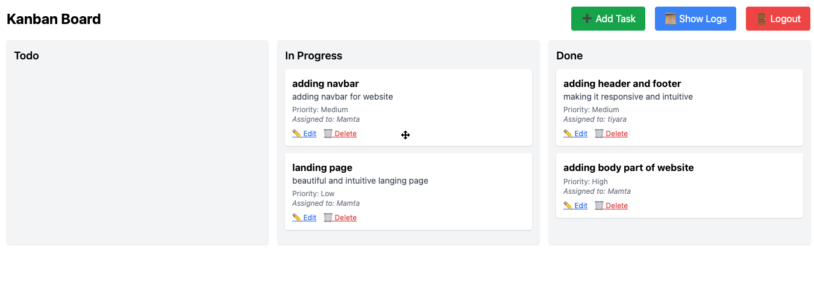

# 🧠 Kanban Task Management App

A collaborative real-time task management Kanban board with smart auto-assignment, user assignment, and activity logs.

---

## 🚀 Features

- 📝 Create, Edit, Delete tasks
- 🧠 Smart Assign (assign task to least-loaded user)
- 👥 Manual user assignment
- 📦 Drag and drop tasks across columns (`Todo`, `In Progress`, `Done`)
- ⚡ Real-time task updates using Socket.io
- 🕵️ Action Logs to track task creation, updates, and deletion
- 🔐 Authentication-secured API routes
- 🎯 Responsive UI built with React and Tailwind CSS

---

## 📁 Tech Stack

### Frontend
- React.js
- Tailwind CSS
- Axios
- @hello-pangea/dnd (for drag & drop)
- Socket.io-client

### Backend
- Node.js + Express.js
- MongoDB + Mongoose
- Socket.io (server)
- JWT Authentication

---

## 🔧 Installation & Setup

### 📦 Backend

```bash
cd backend
npm install
Create a .env file with:


MONGO_URI=your_mongodb_uri
JWT_SECRET=your_jwt_secret
Start the server:


node index.js
🌐 Frontend

cd client
npm install
npm start
🔐 Authentication
This app uses JWT for route protection.

On login, a token is saved to localStorage.

Token is included in Authorization headers for all API calls.

📦 API Endpoints
🔹 Task Routes (/api/tasks)
Method	Route	Description
GET	/	Fetch all tasks (populated with assignees)
POST	/	Create new task
PUT	/:id	Update task
DELETE	/:id	Delete task
POST	/:id/smart-assign	Smart assign task to a user

🔹 User Routes (/api/users)
Method	Route	Description
GET	/	Fetch all users

🔹 Action Logs (/api/logs)
Method	Route	Description
GET	/	Fetch latest 20 logs (with user & task info)

✨ Smart Assign Logic
Automatically assigns a task to the user with the fewest assigned tasks.

Can also assign manually from dropdown.

📸 Screenshots





📌 Notes
Make sure MongoDB is running and the correct URI is set.

Smart Assign requires at least one user in the database.

Real-time features only work when multiple clients are connected.

✅ Future Improvements (optional)
Add search & filter options

Add user roles (Admin, Manager, Member)

Improve error handling and validation

Add pagination in logs


👤 Author
Mamta Vyas

GitHub:  https://github.com/mamta-vyas

LinkedIn: https://www.linkedin.com/in/mamtavyas/